# IW5 závěrečný dotazník 2023

Celkový počet studentů v předmětu: 39  
Počet odpovědí v dotazníku: 19

## Přednášky
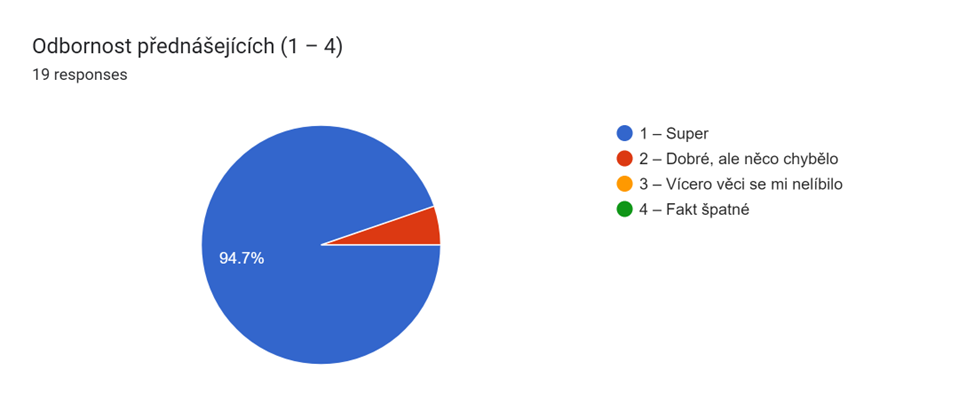
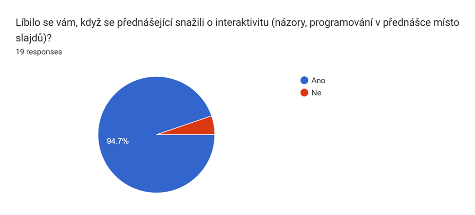

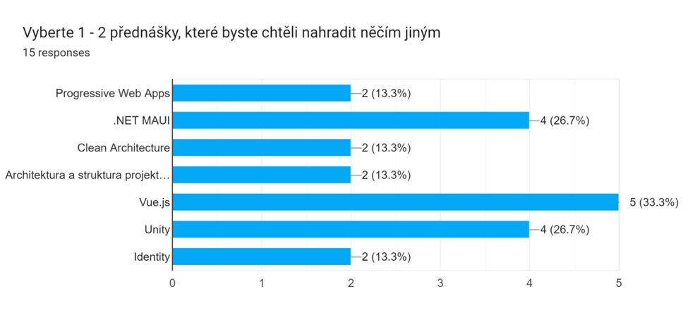
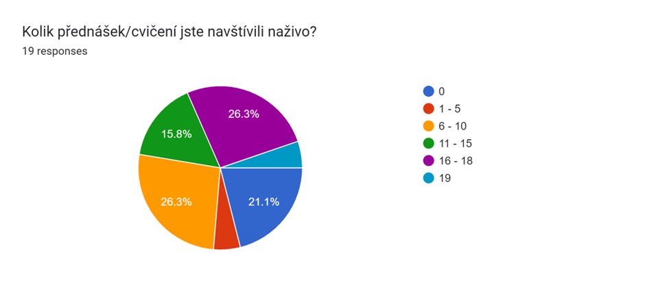
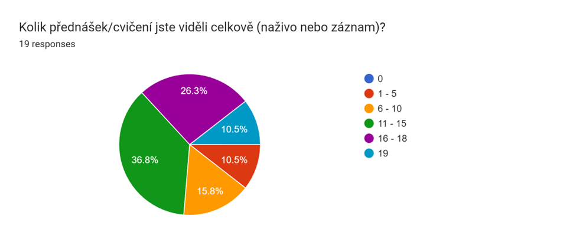
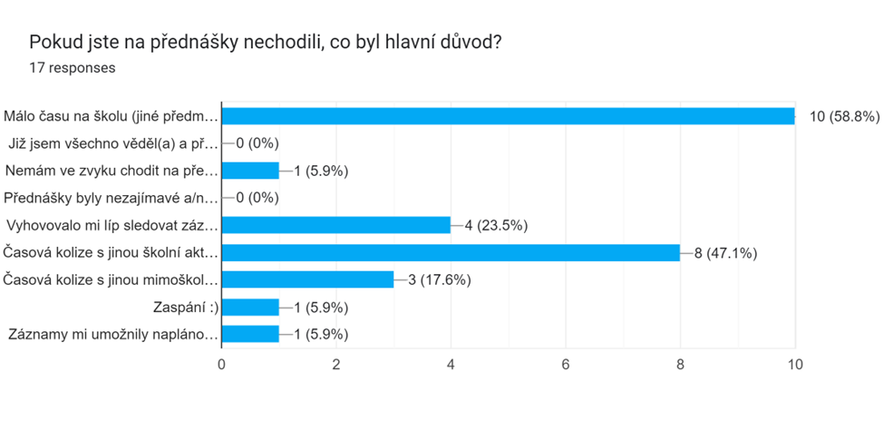
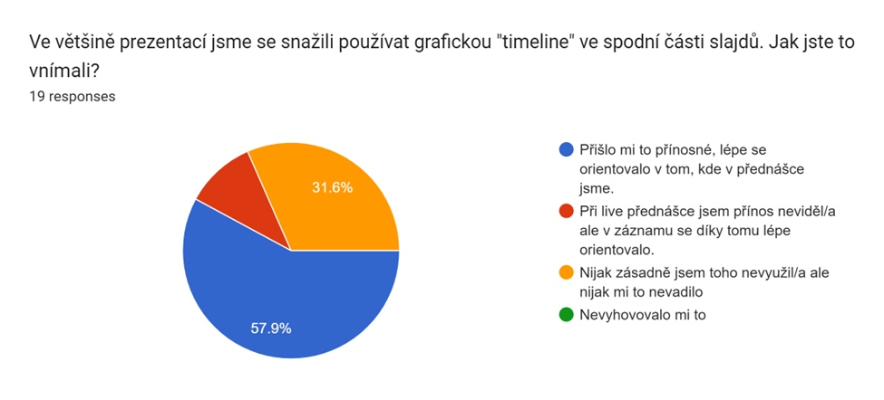

## Projekt
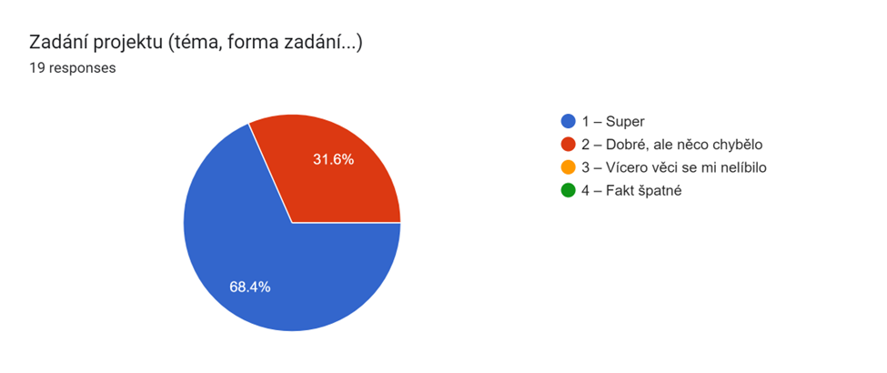
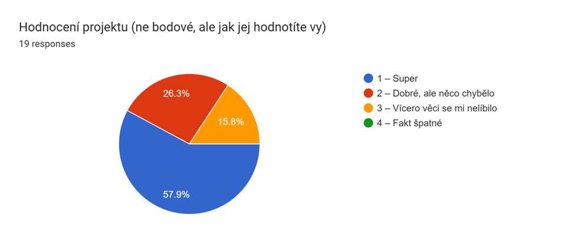
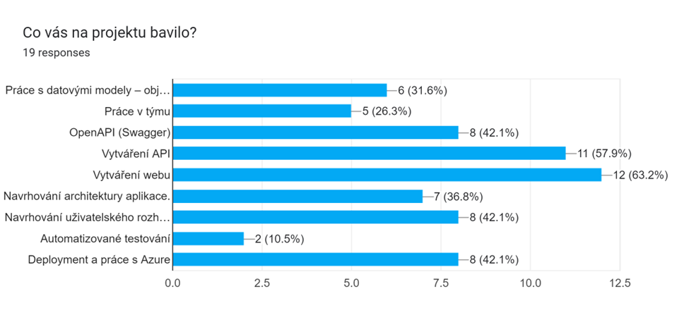
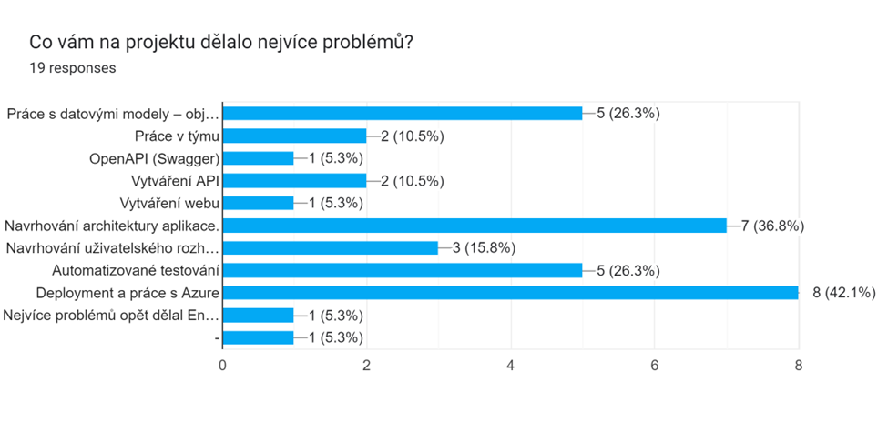
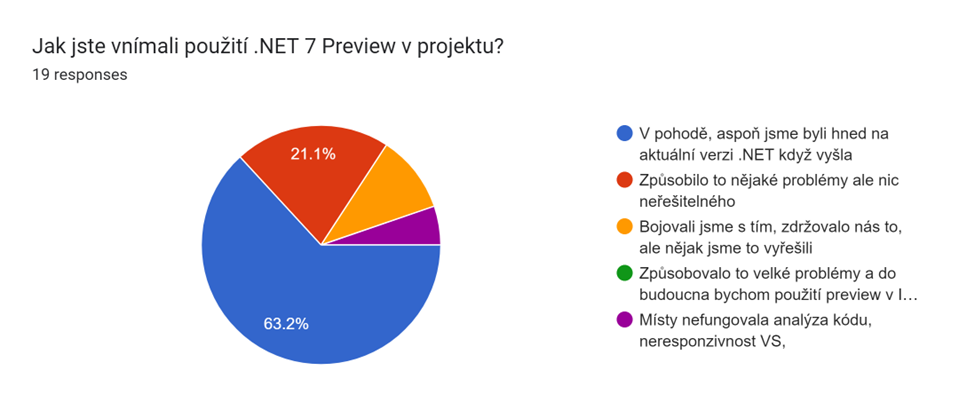
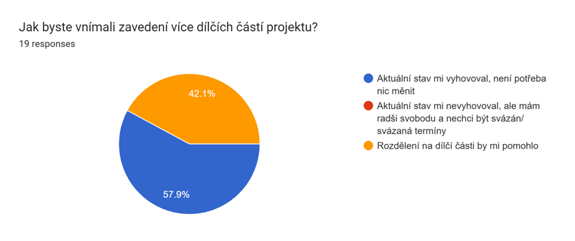
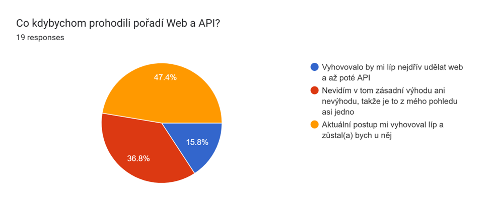

## Celkové hodnocení předmětu
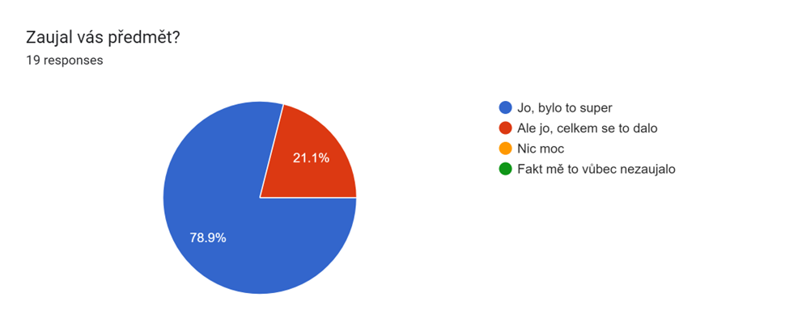
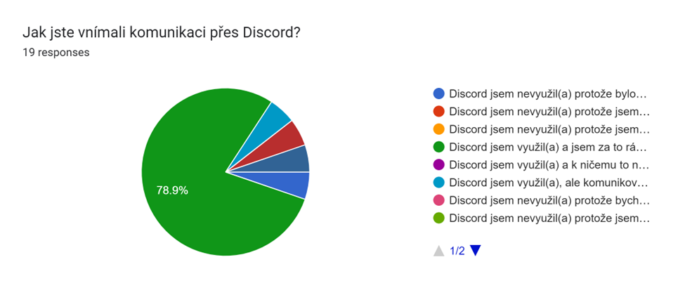
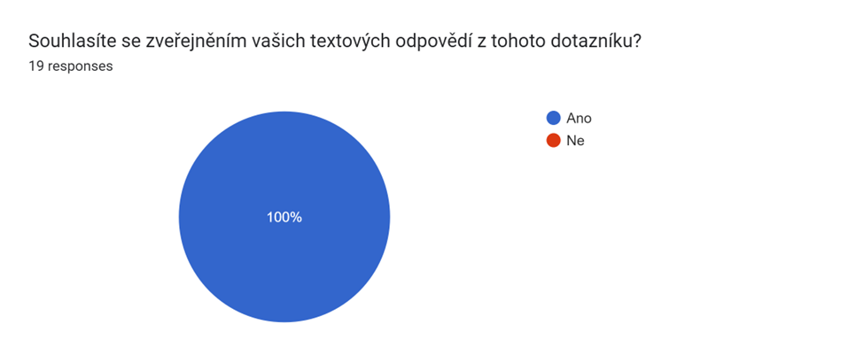

## Textové odpovědi

### Nějaké další poznámky k přednáškám.
- Za mě velký přínos cvičení, nahrávání a různorodost témat přednášek. Volba poslední přednášky mi přišla také super.
- Skvělý výběr extrenistů, zábavná dynamika přednášek. Na pár přednáškách jsem nebyl, ale uvítal bych více info o přepínání jazyka webu nebo aplikace. Definitivně nejlepší a nejužitečnější přednášky semestru.
- Přednášky mi přišly celkově velice přínosné. Na přednášejících šlo vidět, že se o probírané témata zajímají a velice mu rozumí. I přes to, že mě dotnet moc nezajímá (mám raději JS), tak byly přednášky velice přínosné celkově v oblasti web developmentu. Za mě velice kvalitní zpracování, tak to má vypadat.
- Prednášky a témy preberané na nich boli super rovnako ako odbornosť prednášajúcich.

### Měli byste nějaký nápad na téma zadání pro budoucí ročníky?
- Autoservis, útulek pro psy
- Online fórum
- CarSharing,AirBnb
- Systém pre organizovanie položiek v sklade a vo výrobe. Súčiastky by prihádzal na paletách, tie by sa potom uskladňovali, neskôr zase by boli zobraté do výroby, hotový výrobok opäť naskladnený a nakoniec by bol zo skladu vybratý do predaja.
- Program hvězdárny s možností koupení vstupenky a přidání akcí. Alternativně nějaká veřejná budova s vlastním programem a lístky.

### Co byste na projektu vylepšili/co se vám nelíbilo?
- Někdy zbytečně tlačíte jak má být projekt rozdělěn, (Entity,DataAcces atd)
- Asi by som ponechal iba možnosť databázového uloženia dát. Je fajn spomenúť in memory, ako to funguje a že to je alternatíva, ale prínosnejšie mi príde presadzovať databázový prístup v riešení projektu.
- Rozdělení projektu na vícero částí by mohlo být lepší. S vícero projekty a bp pak dělám projekty spíš nárazově.  
Zajímavé by mohlo také být, si zadat před začátkem práce na projektu očekávané rozdělení práce a pak finální (jak to dopadlo). Pro vlastní reflexi čistě pro tým, ne pro hodnocení.
- Přílišná jednoduchost DAL logiky, v ICS byla komplexnější a flexibilnější
- K otázce Co kdybychom prohodili pořadí Web a API? - Rád bych si to zkusil, vzhledem k tomu, že v ostatních projektech na FITu vždy postupuju od databáze.
- Nevím, jestli je i nějaké jiné řešení na dotnet aplikace z hlediska deploye, ale Azure mi přišel na takový malý projekt dost overkill. Asi je to kvůli tomu, že jsem na deploy zvyklý používat Jenkins a Gitlab Pipelines. Nám osobně ale na projektu největší problém dělalo právě setupnutí buildu.
- Pre mňa ako pre druháka bola veľmi veľká časť projektu mágia (veľa bolo copypaste z cookbooku bez potreby tomu rozumieť). Bolo by super keby táto mágia je viac vysvetlená na prednáškach a cvikách. Áno, je pravda, že určité časti boli vysvetlené ale vôbec mi to nestačilo. Možno je to tým, že som nemal možnosť mať ešte ICS ale aj napriek tomu je tento predmet dostupný druhákom. Inak zadanie projektu bolo super a som veľmi rád, že som si mohol skúsiť Blazor.

### Co byste na předmětu změnili/vylepšili?
- zahrnul bych do projektu autentizaci s autorizací
- Osobně mi přišlo, že bylo v projektu využito přiliš mnoho vrstev. Chápu, že nás chcete naučit ty nejlepší praktiky, ale např. toto mě úplně odradilo od cookbooku.
- Presunul by som prednášky o testovaní a o napájaní WEB na API pred prednášku s názvom Frontend. Príde mi že táto prednáška bola skôr záujmová, ukázala zopár toolov ktoré môžme využiť, ale nič fundamentálne k dokončeniu projektu mi asi nedala. Príde mi preto že obe prednášky aj s nimi súvisejúce cviká by bolo užitočnejšie mať pred touto prednáškou.
- Organizací a přínosem nejlepší předmět ve třeťáku, takže těžko říct. To se omlouvám :D
- Nic, bylo to super
- Realne je to jediny predmet za cele studium kde som nevynechal ani prednasku
- Předmět se mi zdal přínosný. Za mě asi nic, co by potřebovalo změnu.